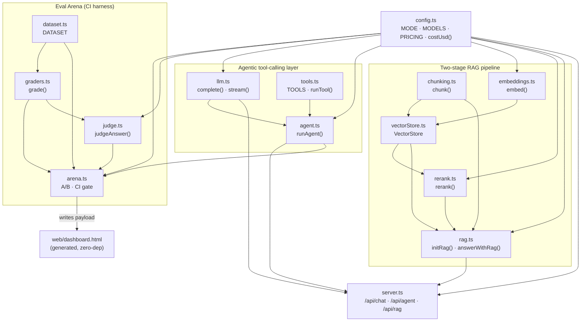
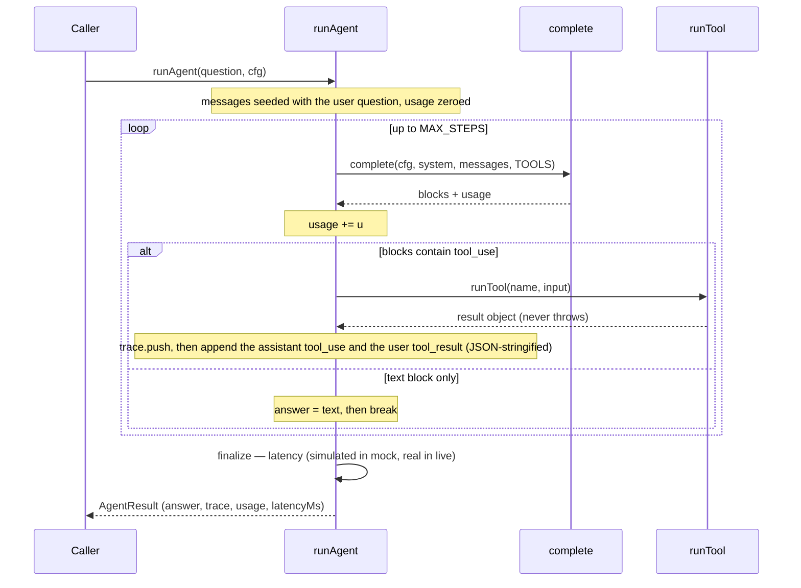
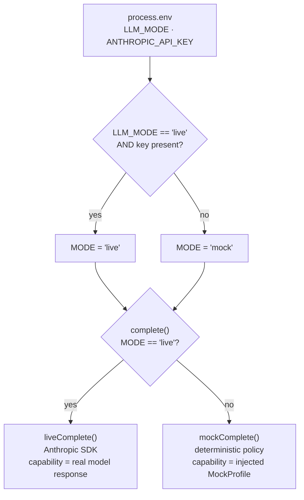
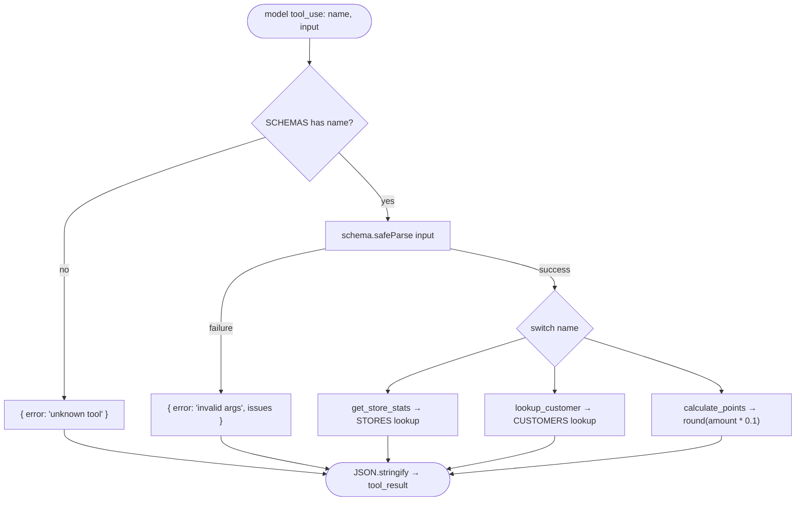
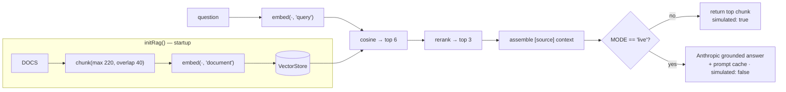
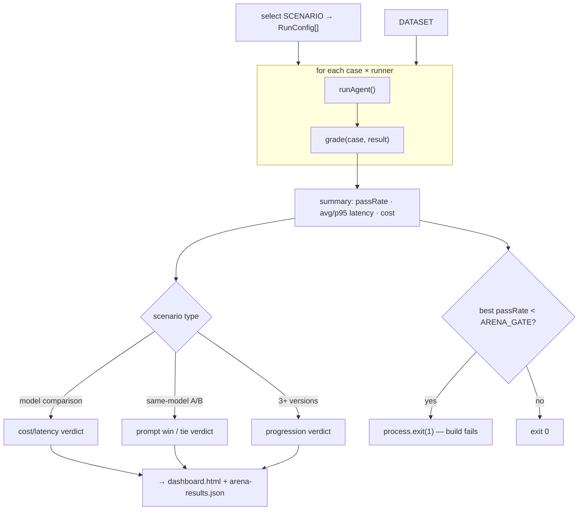

# Architecture

AI Arena is a TypeScript portfolio that demonstrates production-shaped AI product engineering:
an **agentic tool-calling loop**, a **two-stage RAG pipeline**, and an **Eval Arena** A/B harness
with a CI pass-rate gate. Every subsystem runs deterministically in **mock mode** (no API keys) and
switches to real providers in **live mode** via a single environment variable.

> For the request-by-request walkthroughs (chat / agent / RAG), see [`DATAFLOW.md`](./DATAFLOW.md).

---

## 1. Design principles

Three ideas shape every module boundary in the codebase:

1. **Interface stability over implementation completeness.** `VectorStore.search()`, `embed()`,
   `rerank()`, and `complete()` have identical signatures in mock and live. Swapping an in-memory or
   toy implementation for a production one (pgvector, Voyage, Anthropic) is a drop-in that never
   touches a call site outside the module. See the [migration table](#9-production-migration-path).
2. **Measurement is a first-class concern.** Every `AgentResult` carries `usage`, `latencyMs`, and
   `simulatedLatency`. The Arena gates CI on pass-rate. There is no "add observability later."
3. **The type system is the first runtime guard.** `strict: true` + `NodeNext` + `tsc --noEmit`
   catch contract violations before any code runs; model output is typed `unknown` at the boundary
   and must be narrowed (via Zod) before use.

---

## 2. System overview

The code is organized into three subsystems over a shared configuration root (`src/config.ts`):

| Layer | Modules | Role |
|---|---|---|
| **Config** | `config.ts` | Single source of truth: `MODE`, model IDs, pricing, latency, `costUsd()`. |
| **Agentic loop** | `llm.ts`, `tools.ts`, `agent.ts` | Tool-calling loop over a uniform `complete()` contract. |
| **Two-stage RAG** | `chunking.ts`, `embeddings.ts`, `vectorStore.ts`, `rerank.ts`, `rag.ts` | chunk → embed → retrieve → rerank → ground. |
| **HTTP** | `server.ts` | Express API exposing chat (SSE), agent, and RAG. |
| **Evals** | `evals/dataset.ts`, `evals/graders.ts`, `evals/judge.ts`, `evals/arena.ts` | Golden dataset → grader + LLM-judge → A/B summary → dashboard + CI gate. |
| **Web** | `web/dashboard.template.html` | Self-contained dashboard with a scenario selector (renders 2- and 3-runner tabs), generated by the Arena. |

### Component responsibilities

| Component | Responsibility | File |
|---|---|---|
| Env loader | `process.loadEnvFile()` — populates `process.env` from `.env` before config reads it | `src/env.ts` |
| Config | `MODE`, `MODELS`, `PRICING`, `EMBED_MODEL`, `RERANK_MODEL`, `MODEL_LATENCY`, `costUsd()` | `src/config.ts` |
| LLM | Uniform `complete()` / `stream()`; live (Anthropic) vs deterministic mock policy | `src/llm.ts` |
| Tools | `TOOLS` (JSON schema) + Zod-validated `runTool()`; the untrusted-input boundary | `src/tools.ts` |
| Agent | Bounded agentic loop; accumulates trace + usage; reports latency | `src/agent.ts` |
| Chunking | Recursive separator splitting with overlap + citation metadata | `src/chunking.ts` |
| Embeddings | `embed(texts, inputType)` — asymmetric query/document; Voyage or toy fallback | `src/embeddings.ts` |
| VectorStore | In-memory cosine store; pgvector-shaped `addChunks` / `search` interface | `src/vectorStore.ts` |
| Rerank | Cross-encoder precision pass (Voyage) with identity fallback | `src/rerank.ts` |
| RAG | Orchestrates the pipeline; grounds the answer (mock vs live) | `src/rag.ts` |
| Server | Express routes: `GET /api/chat` (SSE), `POST /api/agent`, `POST /api/rag` | `src/server.ts` |
| Dataset | Golden `Case[]` with tool + answer expectations (+ optional `rubric`) | `evals/dataset.ts` |
| Graders | Pure `grade(case, result)` → `{ pass, reasons }`; deterministic tool + value checks | `evals/graders.ts` |
| Judge | LLM-as-judge for open-ended answers — deterministic in mock, haiku in live | `evals/judge.ts` |
| Transcripts | Record/replay store — hash-keyed real model responses for deterministic offline replay | `src/transcripts.ts` + `evals/fixtures/` |
| Arena | A/B runner, summary, verdict, dashboard, CI gate | `evals/arena.ts` |

### Module dependency graph



**Invariants worth noting:** `tools.ts` and `chunking.ts` have zero `src/` imports (pure, trivially
testable). `evals/arena.ts` depends on `agent.ts` but never on `server.ts`, so CI runs the harness
without starting an HTTP server. `web/dashboard.html` carries its own data and needs no server.

---

## 3. The agentic loop

`runAgent()` (`src/agent.ts`) drives a bounded ReAct-style loop capped at `MAX_STEPS = 5`. Each
iteration calls `complete()`; if the model returns `tool_use` blocks they are executed via `runTool()`,
serialized to JSON, appended as a `tool_result` turn, and the loop continues. When the model returns a
text block, `finalize()` seals the result.

Key interfaces:

```ts
type Block =
  | { type: "tool_use"; id: string; name: string; input: any }
  | { type: "text"; text: string };

interface Usage  { inTok: number; outTok: number; costUsd: number; }
interface AgentResult {
  answer: string; trace: TraceStep[]; usage: Usage;
  latencyMs: number; simulatedLatency: boolean;
}
```

Design decisions:

- **`MAX_STEPS = 5` hard ceiling** — prevents runaway loops; returns a deterministic stop message
  instead of throwing.
- **`tool_result.content` is always `JSON.stringify(result)`** — the Anthropic Messages API requires
  a string (or content blocks), never a bare object. The mock policy reverses this with `JSON.parse`,
  so both modes agree on the wire shape.
- **Usage accumulates additively across steps** — one turn can span several model calls; the caller
  receives the true total cost/tokens.
- **Simulated latency is a function of the model, not the prompt** (`MODEL_LATENCY[cfg.model]` plus a
  ≤49 ms question-length jitter that is identical across prompts on the same model), so a same-model
  prompt comparison isolates quality with negligible latency noise.



---

## 4. Mock / live parity

The defining architectural idea. The agentic layer (agent loop, tools) is entirely mode-agnostic — its
only mode branch is `complete()` in `src/llm.ts`. Two other modules carry their own `MODE` branch for
the same reason: `src/rag.ts` (grounding: real Anthropic vs the retrieved chunk) and `evals/judge.ts`
(a real haiku judge vs the deterministic substring stand-in).

- `MODE` is resolved once at module load: `LLM_MODE === "live" && ANTHROPIC_API_KEY ? "live" : "mock"`.
  A missing key safely degrades to mock (and logs a warning); a present-but-invalid key stays live and
  surfaces the provider's auth error on the first call.
- In **live** mode, `liveComplete()` calls Anthropic; the capability difference between prompts emerges
  from the real model reading different instructions.
- In **mock** mode, `mockComplete()` is a deterministic policy driven by a per-runner `MockProfile`
  (`{ chains, reasons, refuses }`). In the `prompts` and `iterations` scenarios the Arena injects a weak
  profile for v1 and a strong one for v2/v3, so the pass-rate delta is **injected, not derived from
  prompt text**. (The `models` scenario instead gives all three runners the *same* strong profile, so its
  100% tie is a genuine equal-capability comparison, not injected asymmetry.) This lets the whole
  harness run — and produce a real, non-trivial delta — without any API key. `npm run arena:live`
  produces a genuinely prompt-driven delta.



The `mockComplete()` policy is an ordered priority ladder: floor capabilities (match a store ID,
customer ID, or shekel amount and call the matching tool) run regardless of profile; the `chains`,
`reasons`, and `refuses` flags each gate exactly one higher-order behavior (chain a second tool, draw a
yes/no conclusion, refuse when data is missing). Each flag maps to a specific dataset case.

---

## 5. The tool layer & validation boundary

`src/tools.ts` sits at the boundary between the **untrusted** model and **trusted** execution. It keeps
two schemas deliberately:

- **`TOOLS`** — JSON Schema `input_schema`, sent to the model so it knows what to produce. A
  specification, not enforcement.
- **`SCHEMAS`** — Zod schemas, run at runtime before any handler executes. The actual gate. All use
  `.strict()` (reject unexpected keys a prompt-injected model might smuggle in) and `calculate_points`
  adds `.nonnegative()` (a business rule the model's own schema does not express).

`runTool()` **never throws**: an unknown name, invalid args, or a missing record all return a typed
`{ error }` object that becomes the next `tool_result`, letting the model self-correct.



---

## 6. The two-stage RAG pipeline

`src/rag.ts` orchestrates a classic **retrieve-then-rerank** pipeline. `initRag()` runs once at startup
(chunk + embed the `DOCS` into the store); `answerWithRag()` runs per request.

Stages:

1. **Chunk** (`chunking.ts`) — recursive split along natural boundaries (`\n\n` → `\n` → `. ` → … → ` `)
   with a hard-cut fallback, plus overlap that carries a tail of the previous chunk. Each chunk keeps
   `{ source, index }` for citation.
2. **Embed** (`embeddings.ts`) — asymmetric encoding: documents use `input_type: "document"`, queries
   use `"query"` (Voyage represents them differently for better alignment). Falls back to a 256-dim
   normalized hash embedder with no key.
3. **Retrieve** (`vectorStore.ts`) — cosine similarity over the in-memory store, `top 6` (recall). The
   `addChunks` / `search` interface is deliberately shaped like pgvector's `<=>` operator.
4. **Rerank** (`rerank.ts`) — Voyage cross-encoder reads query+chunk jointly, `top 3` (precision).
   Identity fallback (`slice(0, topN)` + a warning) on missing key or error.
5. **Ground** (`rag.ts`) — mock returns the top retrieved chunk; live calls Anthropic with a two-block
   system prompt (stable instruction carries the `cache_control` breakpoint; per-query context follows).



---

## 7. The Eval Arena & CI gate

`evals/arena.ts` is a standalone CLI harness (it drives `runAgent()` directly, bypassing HTTP). For
each dataset case × each runner it runs the agent, grades with the pure `grade()` function, and
aggregates per-runner `passRate`, `avg`/`p95` latency, and cost.

- **Three scenarios:** `prompts` (v1 vs v2, same model — the flagship), `models` (haiku vs sonnet vs opus —
  all runners get the *same* strong profile, so all score 100% and the comparison is a genuine
  cost/latency call rather than injected asymmetry), and `iterations` (v1 → v2 → v3). `npm run arena`
  runs all three into one `web/dashboard.html`, selectable from the dashboard's scenario tabs.
- **Pure, trace-based grader:** `grade()` checks the tool *trace*, not just answer substrings — a model
  that prints the right number without calling the tool fails. Numeric expectations normalize thousands
  separators (so a real model's `95,000` satisfies `95000`) and use a digit boundary so `"35"` doesn't
  match inside `"350"`. It is a pure function, so it is unit-tested directly.
- **Hybrid grading with an LLM-as-judge:** structured expectations (tools, exact values) are graded
  deterministically; open-ended answers carry a `rubric` and are graded by `evals/judge.ts` — a
  deterministic substring stand-in in mock (keeps CI free and reproducible), and a real haiku judge in
  live. This is what makes live scores meaningful: a model that refuses or concludes correctly but
  phrases it differently is no longer a false negative. (In an observed live run, open-ended cases that
  a rigid substring check misgraded were scored correctly once the judge read them against the rubric;
  live numbers depend on the model and are not reproduced in mock CI.)
- **Verdict:** `decideVerdict()` branches first on whether the runners share a model. A **model
  comparison** (`models`, any number of runners) resolves to a cost/latency call when quality ties
  ("Ship {cheapest}") or a quality-vs-cost tradeoff question when one model leads but costs more. A
  **same-model 2-way prompt A/B** (`prompts`) reads as a tie or a pass-rate move you can prove with a
  number. A **same-model 3+ version run** (`iterations`) gets a progression read. The `models` scenario
  lands in the tie branch — Haiku, Sonnet, and Opus all score 100% — so its verdict reads "a tie on
  quality … the decision is pure cost/latency … Ship Haiku · fast."
- **Artifacts:** writes `arena-results.json` and stamps `web/dashboard.html` by replacing a single token
  in the template (with `<` → `<` escaping and a function replacer to neutralize `$`/`</script>`).
- **CI gate:** `process.exit(1)` when the best runner's pass-rate is below `ARENA_GATE` (default 80).
  The gate applies to **every** scenario.



### Record / replay — gating on real model behavior

The mock scenario's prompt delta is *injected* via `MockProfile`, so on its own it proves a workflow, not
a measurement. `src/transcripts.ts` closes that gap with a VCR/cassette pattern: `complete()` and
`judgeAnswer()` are wrapped so that

- **`RECORD=1`** (`npm run arena:record`, live) captures every model completion and judge verdict, keyed
  by a content hash of the request, into `evals/fixtures/transcripts.json`.
- **`REPLAY=1`** (`npm run arena:replay`) serves those recordings back with **zero API calls**. Because the
  agent loop and grader are deterministic given the model outputs, replaying the same hashed requests
  reconstructs the exact recorded run — reproducibly and offline.

CI runs the replay on every push, so the gate is on **real recorded model output**, not a stand-in. A
missing fixture (e.g. the dataset changed without re-recording) fails loudly, which is the correct
discipline. Pass/fail and token cost are real; latency stays simulated for a clean same-model comparison.
The honest finding it surfaces: a real model follows **both** prompt v1 and v2 well enough to pass every
case, so the recorded `prompts` run **ties** (100%/100%) — the mock's injected v1→v2 gap is an
illustration of what a genuine regression *would* look like, not a measured one. Where a real lever does
exist is model selection: the mock `models` scenario shows Haiku, Sonnet, and Opus all at 100%, so the
decision falls to **cost/latency** (Haiku matches the stronger tiers at ~3× less than Sonnet). Dashboard
and recorded run agree: on this golden set quality is saturated, and the number that moves the decision
is cost.

---

## 8. Tech stack

| Concern | Choice | Why |
|---|---|---|
| Language | TypeScript 6, `strict`, `NodeNext`, `noEmit` | Types are the boundary guard; `NodeNext` enforces `.js` import specifiers |
| Runtime | Node ≥ 20.12 (`engines`) | `process.loadEnvFile()` (20.12+); `fetch`, `AbortSignal.timeout`, top-level `await` all native |
| Dev runner | `tsx` | Runs `.ts` directly (esbuild) — no build step for the demo |
| Tests | `vitest` | ESM-native, fast, no transform config |
| HTTP | `express` | Minimal; the three routes are the stable public contract |
| Validation | `zod` | `.strict()` + `.safeParse()` for untrusted model output |
| LLM | `@anthropic-ai/sdk` (dynamic import) | Official SDK; only loaded in live mode |
| Embeddings/Rerank | Voyage REST via `fetch` | No official Node SDK; raw fetch is trivially mockable, 15s timeouts |

`@anthropic-ai/sdk` is dynamically `import()`-ed inside `liveComplete`/`stream`/`answerWithRag`/`liveJudge`,
so the mock path never evaluates it.

---

## 9. Production migration path

Each demo/toy piece sits behind a stable interface, so production is a drop-in behind that interface:

| Demo / toy piece | Production replacement | Interface that stays unchanged |
|---|---|---|
| In-memory `VectorStore` (cosine, O(n) scan) | Postgres + pgvector (`<=>` operator, ANN index) | `addChunks(Chunk[])` / `search(query, topK)` |
| Toy hash embedder | Voyage `voyage-4` (already wired; used when `VOYAGE_API_KEY` set) | `embed(texts, inputType)` |
| Identity reranker | Voyage `rerank-2.5` (already wired) | `rerank(query, hits, topN)` |
| `mockComplete` policy | Anthropic API (`liveComplete`, already wired) | `complete(cfg, system, messages, tools)` |
| Static `STORES`/`CUSTOMERS`/`DOCS` | DB / service / blob store + indexing | `runTool(name, input)` / `answerWithRag(question)` |
| No auth / rate-limit | Auth middleware + per-user cost cap (uses `usage.costUsd`) | Express `app.use()` + unchanged `runAgent` |
| Single-process, no retry | Retries + timeout + circuit breaker (15s `AbortSignal` is the baseline) | `embed()` / `rerank()` bodies |
| `console.*` logging | Structured logging + tracing (`TraceStep[]` already structured) | `AgentResult.trace` shape |
| No PII / injection guard | Input sanitization + PII redaction pre-`runAgent` | `runAgent(question, cfg)` |

---

## 10. Environment variable contract

| Variable | Default | Effect |
|---|---|---|
| `LLM_MODE` | `mock` | `live` + a key activates real Anthropic calls |
| `ANTHROPIC_API_KEY` | — | Required for live; absent → stays mock |
| `VOYAGE_API_KEY` | — | Activates real Voyage embeddings + rerank (orthogonal to `LLM_MODE`) |
| `VOYAGE_EMBED_MODEL` | `voyage-4` | Override embedding model |
| `VOYAGE_RERANK_MODEL` | `rerank-2.5` | Override rerank model |
| `ARENA_GATE` | `80` | Minimum pass-rate for the CI gate |
| `SCENARIO` | *(all 3)* | Run one Arena scenario (`prompts` / `models` / `iterations`); unset runs all three into one dashboard (record/replay always use `prompts`) |
| `PORT` | `3000` | Express server port |

The four valid mode combinations:

```
mock + no Voyage   → fully local, zero cost (this is what CI runs)
mock + Voyage      → mock LLM, real embeddings/rerank
live + no Voyage   → real Anthropic, toy embedder (dev)
live + Voyage      → fully live
```

**`.env` loading.** `src/env.ts` calls `process.loadEnvFile()` and is imported first by `config.ts`, so
`.env` populates `process.env` before `MODE` is computed. `loadEnvFile()` never overrides an
already-set variable, so the deterministic scripts pin themselves to mock — `npm test` runs with
`LLM_MODE=mock ANTHROPIC_API_KEY= VOYAGE_API_KEY=` and `npm run arena` with `LLM_MODE=mock` — and stay
free and reproducible even when `.env` holds live keys. `.env` is git-ignored; `.env.example` is the
committed template.

---

## 11. Testing

47 unit tests (vitest), all deterministic and key-free (mock mode):

| File | Covers |
|---|---|
| `test/config.test.ts` | pricing math + unknown-model safe default |
| `test/tools.test.ts` | valid call, `.strict()` rejection, wrong types, unknown tool, not-found, rounding, customer lookup (case-insensitive) |
| `test/chunking.test.ts` | single-chunk, overlap, no-duplication regression |
| `test/graders.test.ts` | trace-based grading, numeric normalization/boundary, rubric deferral, no-hallucinate |
| `test/judge.test.ts` | LLM-judge mock stand-in + grade()/rubric interaction |
| `test/agent.test.ts` | tool selection, weak-profile chaining, usage accumulation |
| `test/rag.test.ts` | grounded retrieval + citation, vector ranking, empty store |
| `test/embeddings.test.ts` | toy embedder determinism + unit-normalization |
| `test/stream.test.ts` | SSE `stream()` mock output |
| `test/transcripts.test.ts` | record/replay `fixtureKey` determinism, collision-resistance, hex format |
| `test/arena.test.ts` | all three scenarios via `runScenario()`: prompts 50→100, models 100/100/100 tie (Haiku cheapest), iterations 50→100→100, non-empty verdicts, unknown-scenario rejection |
| `test/rerank.test.ts` | live Voyage rerank: reorders by the `data` response field (regression guard), identity fallback on error |
| `test/llm-live.test.ts` | live Anthropic path: `input_tokens`/`output_tokens` → cost mapping + block conversion |

CI (`.github/workflows/ci.yml`) runs typecheck → tests → mock-arena gate → real-replay gate on every
push (not on pull requests — see the trigger note in the workflow), in mock mode, with no secrets.
