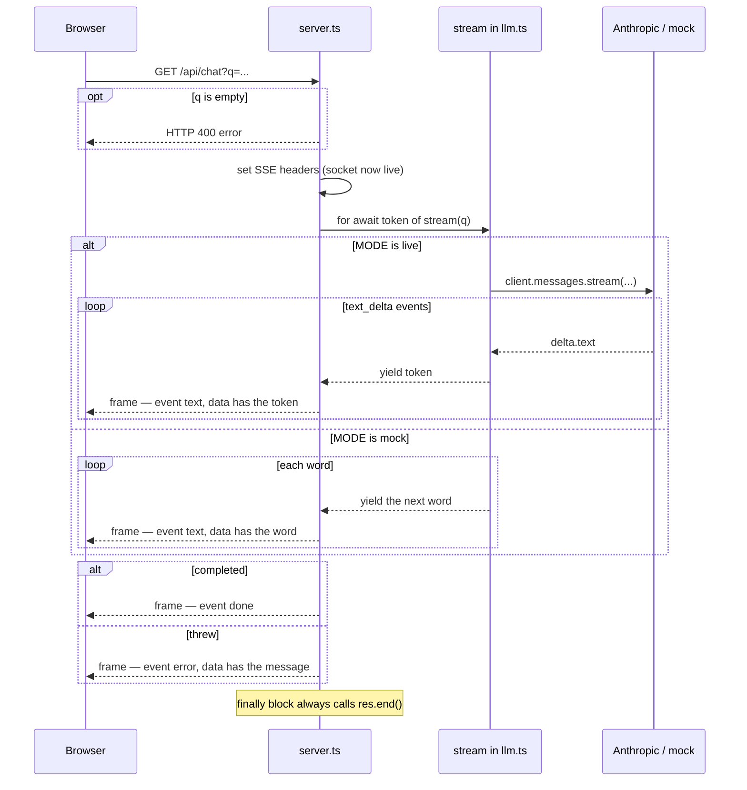
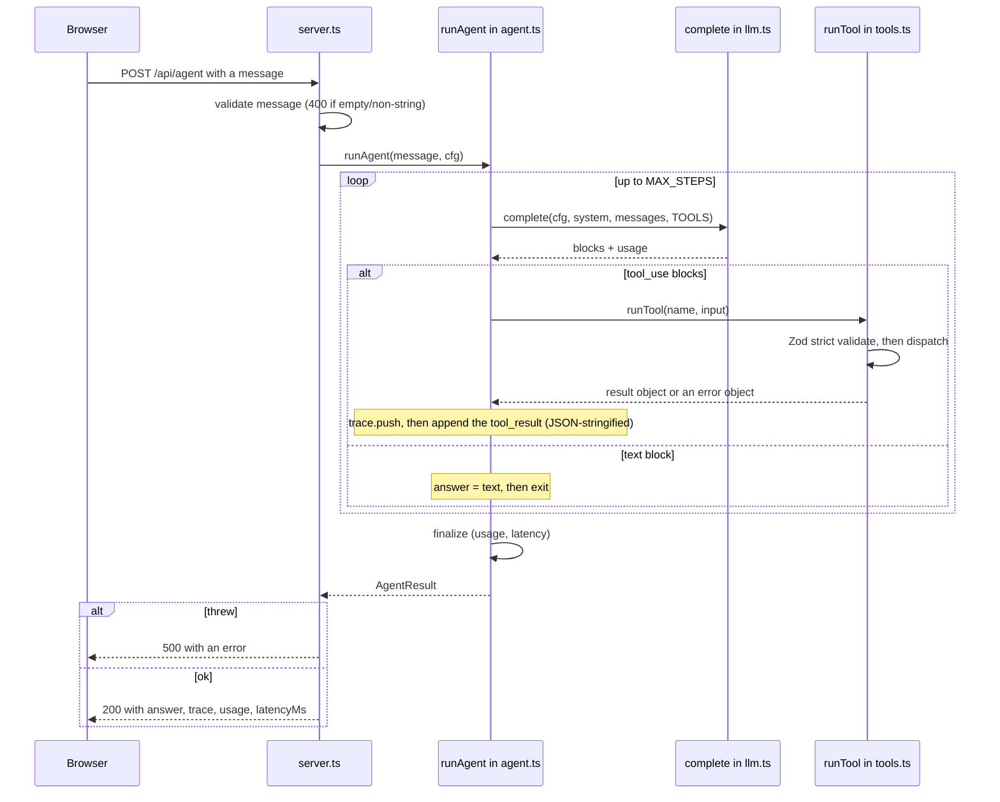
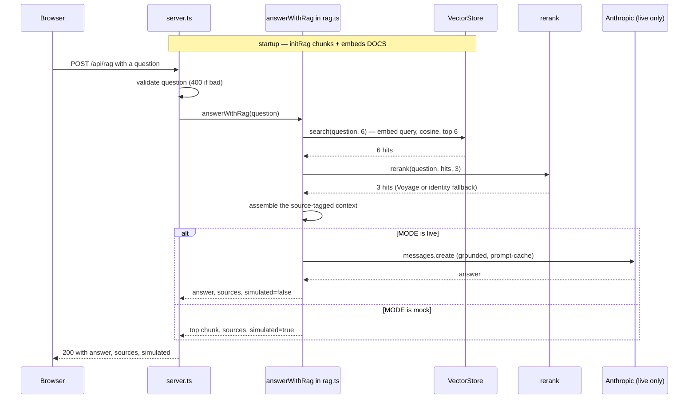

# Data Flow

Request-by-request walkthroughs of the three public endpoints. For the module map and design
rationale, see [`ARCHITECTURE.md`](./ARCHITECTURE.md).

All three routes are served by `src/server.ts` and behave identically in mock and live mode — only the
implementation behind `complete()` / `embed()` / `rerank()` changes. `MODE` is resolved once at startup
(`src/config.ts`): `live` requires both `LLM_MODE=live` and `ANTHROPIC_API_KEY`; otherwise `mock`.

---

## 1. Chat — `GET /api/chat` (SSE)

A browser `EventSource` opens a persistent connection; the server switches into Server-Sent Events mode
and pipes each token from the `stream()` async generator as a named SSE frame. The request is validated
first, so a bad request still gets a real HTTP 400; once the SSE headers are flushed, later errors can
no longer use an HTTP status — they travel as an `event: error` frame instead.

**Flow**

1. Browser opens `new EventSource('/api/chat?q=...')`.
2. `q` is read and trimmed; if empty, the server returns **HTTP 400** `{ error }` immediately — before any
   SSE header is written (consistent with the other two routes).
3. Server sets `Content-Type: text/event-stream` + `Cache-Control: no-cache` (the socket is now live).
4. `stream(q)` is called (default model `claude-sonnet-4-6`).
5. **Mock:** yields a demo answer word-by-word. **Live:** dynamically imports the SDK, calls
   `client.messages.stream(...)`, and forwards `text_delta` events.
6. Each yielded token is written as `event: text\ndata: {"t":"..."}\n\n`.
7. On normal completion: `event: done\ndata: {}\n\n`. On a thrown error (caught, after headers): the error
   is logged server-side and sent as `event: error\ndata: {"error":"..."}\n\n`. A `finally` block always calls `res.end()`.
8. The browser fires `text` / `done` / `error` listeners.

**Frames**

```
event: text
data: {"t":"Hello "}

event: done
data: {}

event: error
data: {"error":"..."}
```

**Consumer (framework-agnostic)**

```ts
const es = new EventSource(`/api/chat?q=${encodeURIComponent(q)}`);
es.addEventListener("text", e => append(JSON.parse(e.data).t)); // React: setState · Angular: signal.update
es.addEventListener("done", () => es.close());
es.addEventListener("error", e => es.close());
```



---

## 2. Agent — `POST /api/agent`

A JSON `{ message }` body drives the bounded tool loop in `runAgent()`, returning the answer plus the
full tool trace, cumulative usage, and latency.

**Flow**

1. `express.json()` parses the body; `message` must be a non-empty string, else **400**.
2. `runAgent(message, { label: "api", model: MODELS.work })` — no `systemPrompt`, so `DEFAULT_SYSTEM`
   (the loyalty-support guardrail) is used.
3. State: `messages = [user message]`, empty `trace`, zeroed `usage`.
4. Loop (≤ `MAX_STEPS = 5`): call `complete()`; if it returns `tool_use` blocks, run each via `runTool()`
   (Zod-validated, never throws), record a `TraceStep`, append the JSON-stringified result as a
   `tool_result` turn, and continue; if it returns a text block, that is the answer.
5. `finalize()` computes latency (simulated in mock, wall-clock in live) and cost.
6. Respond **200** `{ answer, trace, usage, latencyMs }`. Any unhandled throw → **500** `{ error }`.

**Response**

```json
{
  "answer": "Yes, there are enough points (has 240).",
  "trace": [{ "tool": "lookup_customer", "args": { "customer_id": "c-77" },
              "result": { "customer_id": "c-77", "name": "Dana", "store_id": "1001", "points": 240, "tier": "gold" } }],
  "usage": { "inTok": 95, "outTok": 60, "costUsd": 0.001185 },
  "latencyMs": 802
}
```



---

## 3. RAG — `POST /api/rag`

`initRag()` runs once at startup to chunk + embed the policy docs into the in-memory store. Each request
retrieves broadly, reranks precisely, and grounds an answer.

**Startup (once, before `app.listen`)**

1. Construct an empty `VectorStore`.
2. For each doc in `DOCS`, `chunk(source, text, { max: 220, overlap: 40 })`.
3. `store.addChunks(...)` embeds with `input_type: "document"` (Voyage `voyage-4` or toy fallback) and
   stores the vectors.

**Per request**

1. `question` must be a non-empty string, else **400**.
2. `store.search(question, 6)` — embed query (`input_type: "query"`), cosine over all items, top 6 (recall).
3. `rerank(question, hits, 3)` — Voyage cross-encoder to top 3 (precision), or identity fallback + warn.
4. Assemble `[source] text` context and rounded `sources[]`.
5. **Mock:** return the top retrieved chunk with a `(mock)` label prepended (`simulated: true`). **Live:** call Anthropic
   `claude-sonnet-4-6` with a two-block system prompt (stable instruction carries the prompt-cache
   breakpoint; per-query context follows) (`simulated: false`).
6. Respond **200** `{ answer, sources, simulated }`. Unhandled throw → **500**.

**Response (mock)**

```json
{
  "answer": "(mock) Based on the retrieved context: Shipping policy. We ship to Israel, ...",
  "sources": [
    { "text": "Shipping policy...", "source": "policy/shipping", "score": 0.847 },
    { "text": "Returns policy...",  "source": "policy/returns",  "score": 0.612 }
  ],
  "simulated": true
}
```



---

## Error handling summary

| Path | Condition | Result |
|---|---|---|
| `/api/chat` | empty / missing `q` param | `400 { error }` (before SSE headers, same as the other routes) |
| `/api/chat` | stream throws after headers flushed | `event: error` SSE frame, then `res.end()` |
| `/api/agent` | empty / non-string `message` | `400 { error }` |
| `/api/agent` | unhandled throw in loop | `500 { error }` |
| `/api/agent` | model output bad args / unknown tool | soft `{ error }` in the `tool_result` (model self-corrects) |
| `/api/agent` | `MAX_STEPS` exceeded | `200` with a "stopped" answer |
| `/api/rag` | empty / non-string `question` | `400 { error }` |
| `/api/rag` | Voyage embed fails / times out (15s) | propagates to `500` |
| `/api/rag` | Voyage rerank fails / times out | caught → identity fallback + `console.warn` |
