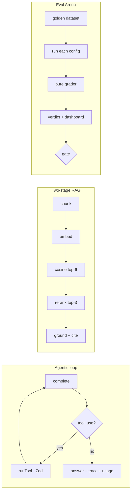

<div align="center">

# ⚔️ AI Arena

**AI product engineering in TypeScript on the Claude API: an agentic tool-use loop with Zod-validated structured outputs, two-stage RAG, and an A/B eval harness that decides between LLM configs on the numbers.**


**▶ [Open the live dashboard](https://arikepstein.github.io/ai-arena/)** — three comparisons in one page (prompt A/B · model cost/latency · iteration), switch with the selector, click any row for the per-case diff. No install.


</div>

> **The thesis:** LLM output is non-deterministic. What makes an AI engineer is the **measurement**,
> not the code. So the centerpiece here isn't the chat — it's the **Eval Arena** and the evals.

> ⚠️ **This is a portfolio/demo, not a production product.** It runs in **mock mode with no API keys**
> so you can evaluate it in two minutes. What it would take to make it production-ready is spelled out
> honestly [below](#-what-it-would-take-to-go-to-production).

---

## ⏱️ Evaluate in 2 minutes

```bash
npm install
npm run ci          # typecheck (strict) + 47 unit tests + evals gate — all green, no keys
npm run arena       # runs all three comparisons → writes web/dashboard.html
open web/dashboard.html   # Linux: xdg-open web/dashboard.html
```

What you'll see: one **dashboard** with a **scenario selector** — flip between the three comparisons the
harness runs: **prompt v1 vs v2** (same model, 50% → 100%), **Haiku vs Sonnet vs Opus** (quality ties at
100% → ship Haiku, the cheapest and fastest), and a **v1 → v2 → v3 iteration**. Each carries a per-case breakdown of
exactly what differs. That's the day-to-day AI-engineering loop: change a config, measure, prove it with a
number. *(These default scenarios are an illustrative **mock** — the v1→v2 quality gap is injected to show
the workflow; the harness also gates CI on **real recorded model runs**, where both prompts and both models
tie at 100% — see [Real results](#-real-results-recorded-and-replayed).)*

---

## 🧭 What's inside

| Capability | Where | One-liner |
|---|---|---|
| **Eval Arena** | `evals/arena.ts` | Runs a golden dataset against each scenario's configs, measures pass-rate / latency / cost, writes a selectable dashboard, and **gates CI** (`exit 1` below `ARENA_GATE`). |
| **Agentic loop** | `src/agent.ts` · `src/llm.ts` | Bounded tool-use (function calling) loop on the Claude API with a uniform `complete()` contract, full trace, and cost accounting. |
| **Structured outputs (Zod tools)** | `src/tools.ts` | Model output is untrusted input — `.strict()` schemas validate every tool call before execution. |
| **Two-stage RAG** | `src/rag.ts` | `chunk → embed → retrieve (recall) → rerank (precision) → ground`, with citations and prompt caching. |
| **Mock/live parity** | `src/config.ts` · `src/llm.ts` | The same code runs deterministically with no keys, or against Anthropic + Voyage in live mode. |
| **Thin HTTP API** | `src/server.ts` | `GET /api/chat` (SSE) · `POST /api/agent` · `POST /api/rag` — one backend, any frontend. |

📐 **Deep dives:** [`ARCHITECTURE.md`](./ARCHITECTURE.md) (modules, design principles, diagrams,
production-migration table) · [`DATAFLOW.md`](./DATAFLOW.md) (per-request walkthroughs with sequence
diagrams).

---

## ⚡ Running it

```bash
npm run arena          # all three comparisons → one dashboard with a scenario selector
npm run arena:models   # focus: haiku vs sonnet vs opus — quality ties, so cost/latency decides (ship Haiku)
npm run arena:iter     # focus: v1 → v2 → v3 — an "improvement" with no eval measuring it doesn't count
npm run arena:live     # against real models (requires ANTHROPIC_API_KEY)
npm run docs:publish   # copy the generated dashboard → docs/ (the live GitHub Pages site)

npm run dev            # server: chat (SSE) + agent + rag → http://localhost:3000
npm test               # 47 unit tests (vitest)
npm run typecheck      # tsc --noEmit, strict
```

To go **live**: copy `.env.example` → `.env` and set `ANTHROPIC_API_KEY` (and `VOYAGE_API_KEY` for
semantic RAG + reranking). `.env` is loaded automatically (`src/env.ts`); set `LLM_MODE=live` in it to
switch. `npm test`, `npm run arena`, and `npm run ci` always force mock mode, so they stay deterministic
and free even with keys present. Exactly the same code path otherwise.

---

## ⭐ The two central ideas

**1. Eval Arena.** Runs a golden dataset against two or three configurations and measures, for each, pass-rate,
latency (avg/p95), cost, and a per-case diff. A **real CI gate**: if the best pass-rate drops below the
threshold (`ARENA_GATE`, default 80%), the process exits 1 and breaks the build. Grading is **hybrid**:
deterministic checks for structured expectations (tool trace, exact values) and an **LLM-as-judge**
(`evals/judge.ts`) for open-ended answers — because a real model refuses or concludes correctly but
phrases it differently than any fixed substring. It writes an automatic verdict into a self-contained
"VS" dashboard that opens in any browser with no server.

**2. Two-stage RAG.** `chunk` (recursive + overlap + citation metadata) → `embed` (Voyage, with
**query/document asymmetry**) → vector retrieval (recall) → **rerank** (`rerank-2.5`, precision) → a
grounded answer with a cited source and prompt caching. A full local fallback runs without a key.



---

## 🎯 Real results, recorded and replayed

The dashboard above is a **mock illustration** of the prompt-versioning workflow — the capability gap is
injected via a `MockProfile`, and the run is badged `mock`. But the harness also runs against **real
recorded Claude responses**, replayed deterministically and offline, so **CI gates on genuine recorded
model behavior, not a hand-authored stand-in.** `npm run arena:record` captures the live transcripts once (into
`evals/fixtures/`); `npm run arena:replay` replays the **prompt v1 vs v2** transcripts with zero API calls, and
CI runs it on every push. (The Haiku-vs-Sonnet row below is a recorded live measurement from the same fixtures.)

What the real recordings show:

| Scenario (real, recorded) | Config A | Config B | Verdict |
|---|---|---|---|
| **Prompt v1 vs v2** — Sonnet | 100% · $0.056/run | 100% · $0.062/run | Tie — a capable model passes both prompts |
| **Haiku vs Sonnet** — same prompt | Haiku 100% · **$0.018/run** | Sonnet 100% · $0.057/run | Tie on quality — **Haiku is ~3× cheaper** on real token cost |

The honest finding: on this golden set, modern Claude models are **quality-saturated** — every case passes.
So the harness's real job here is **cost-driven model selection** (the numbers say ship Haiku); the
mock scenario shows what a genuine quality *regression* would look like when models *do* differ. Measurement, not vibes.

> The live dashboard's **model** tab extends this to **Haiku vs Sonnet vs Opus** for the full cost ladder (Opus lists
> at ~5× Haiku). Opus there is an *illustrative mock*, not recorded; the recorded table above covers the two models
> you'd realistically choose between for this workload. In that mock tab, both latency **and cost** are simulated (real
> list prices × mock token counts, badged on the page) — only the recorded table's cost is measured against real tokens.

---

## 🔌 Connecting React / Angular

The backend is a thin API (SSE). The consumer is identical in both worlds:

```ts
const es = new EventSource(`/api/chat?q=${encodeURIComponent(q)}`);
es.addEventListener("text", e => append(JSON.parse(e.data).t)); // React: setState · Angular: signal.update
```

---

## 🚧 What it would take to go to production

This is a demo. Real production requires:

1. **auth + rate-limit + per-user cost ceiling** — an endpoint that calls an LLM without these is a wallet risk.
2. **Postgres + pgvector** instead of the in-memory store (swap `add`/`search` for the `<=>` operator; the rest of the pipeline is unchanged).
3. **retries + timeout + circuit breaker** on model calls (the Voyage embed/rerank calls already carry a 15s timeout as a baseline; the Anthropic calls still use SDK defaults).
4. **observability** — tracing (prompt/tokens/latency/cost), alerting, drift detection.
5. **security** — prompt injection (direct and indirect), PII redaction.
6. **real embeddings by default** — the Voyage embedder + reranker are already wired in and used whenever `VOYAGE_API_KEY` is set; only the keyless demo falls back to the toy embedder.

`ARCHITECTURE.md` has the full [migration table](./ARCHITECTURE.md#9-production-migration-path) mapping
each demo piece to its production replacement and the interface that stays stable.

---

## 🗺️ Repository layout

```
src/    env · config · llm (client+mock+stream) · tools (Zod) · agent (loop)
        chunking · embeddings · vectorStore · rerank · rag · server · transcripts (record/replay)
evals/  dataset · graders · judge (LLM-as-judge) · arena (A/B + dashboard) · fixtures/ (recorded transcripts)
test/   47 unit tests (config/tools/chunking/graders/judge/agent/rag/rerank/embeddings/stream/transcripts/arena/llm-live)
web/    dashboard (modern, self-contained)
.github/workflows/ci.yml   typecheck + tests + mock gate + real-replay gate on every push
ARCHITECTURE.md · DATAFLOW.md   design + per-request data flow
```

---

## 📊 Data mode

Three ways to run the Arena:

- **`mock`** (default, CI) — pass/fail and tool calls are **real and deterministic**; latency/cost are
  **simulated**. The prompt-v1-vs-v2 gap is **injected** via a per-runner `MockProfile` (the model
  comparison gives both models the *same* profile, so its 100% tie is genuine, not injected) — a stand-in
  that illustrates the workflow without keys. Badged `mock`.
- **`replay`** (`npm run arena:replay`, also in CI) — replays **real recorded Claude responses** from
  `evals/fixtures/` deterministically and offline: pass/fail and token **cost are real**, latency stays
  simulated for a clean same-model comparison. Badged `replay`. This is the reproducible real measurement.
- **`live`** (`npm run arena:live`, needs keys) — everything measured for real against the model, right now.

`npm run arena:record` refreshes the fixtures from a live run. See
[Real results](#-real-results-recorded-and-replayed) for what the recordings show.

---

<div align="center">
<sub><a href="./LICENSE">MIT licensed</a> · built to show what AI product engineering actually looks like.</sub>
</div>
