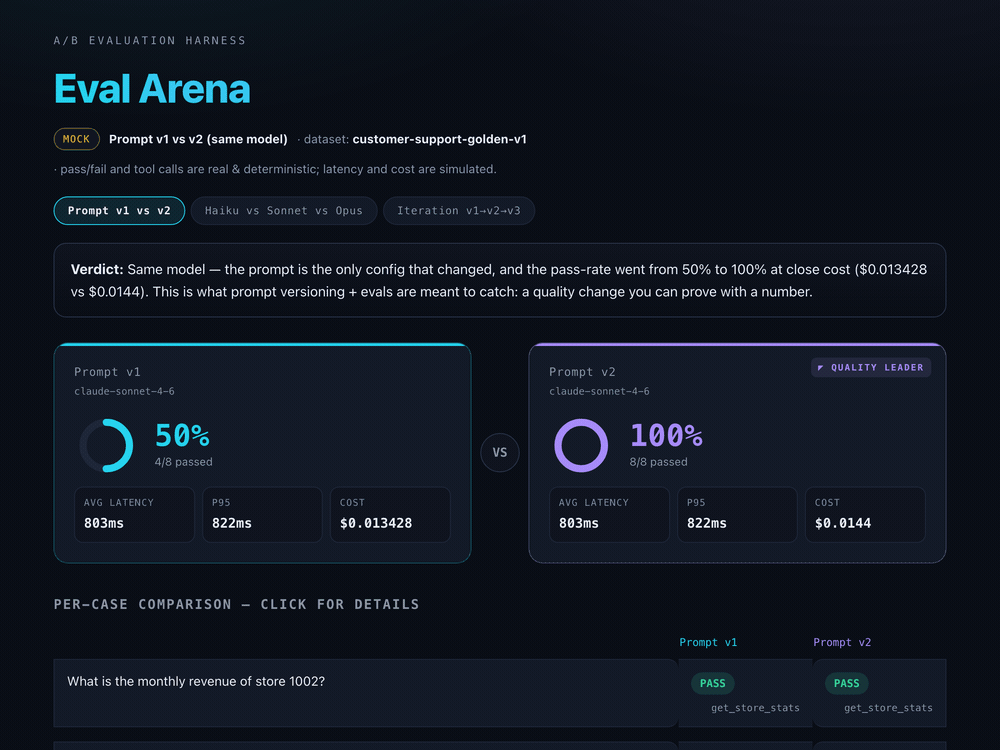
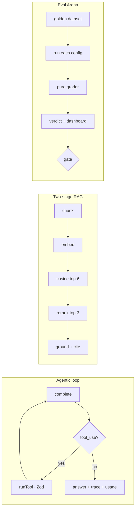

<div align="center">

# ⚔️ AI Arena

**AI product engineering in TypeScript — an agentic loop, two-stage RAG, and an A/B eval harness that decides between LLM configs on the numbers.**



**▶ [Open the live dashboard](https://arikepstein.github.io/ai-arena/)** — interactive, click any row for the per-case diff. No install.

_Solo project — I designed and built the entire stack end-to-end, in strict TypeScript._


</div>

> **The thesis:** LLM output is non-deterministic. What makes an AI engineer is the **measurement**,
> not the code. So the centerpiece here isn't the chat — it's the **Eval Arena** and the evals.

> ⚠️ **This is a portfolio/demo, not a production product.** It runs in **mock mode with no API keys**
> so you can evaluate it in two minutes. What it would take to make it production-ready is spelled out
> honestly [below](#-what-it-would-take-to-go-to-production).

---

## ⏱️ Evaluate in 2 minutes

```bash
npm install
npm run ci          # typecheck (strict) + 35 unit tests + evals gate — all green, no keys
npm run arena       # A/B: prompt v1 vs v2 → writes web/dashboard.html
open web/dashboard.html
```

What you'll see: the **dashboard** shows prompt **v2 beating v1 (63% → 100%)** on the same model, the
same latency, and ~the same cost — a **pure prompt win**, with a per-case breakdown of exactly what got
fixed. That's the day-to-day workflow of an AI engineer: change a prompt, measure, prove it with a number.

---

## 🧭 What's inside

| Capability | Where | One-liner |
|---|---|---|
| **Eval Arena** | `evals/arena.ts` | Runs a golden dataset against two configs, measures pass-rate / latency / cost, writes a dashboard, and **gates CI** (`exit 1` below `ARENA_GATE`). |
| **Agentic loop** | `src/agent.ts` · `src/llm.ts` | Bounded tool-calling loop with a uniform `complete()` contract, full trace, and cost accounting. |
| **Zod-validated tools** | `src/tools.ts` | Model output is untrusted input — `.strict()` schemas validate every tool call before execution. |
| **Two-stage RAG** | `src/rag.ts` | `chunk → embed → retrieve (recall) → rerank (precision) → ground`, with citations and prompt caching. |
| **Mock/live parity** | `src/config.ts` · `src/llm.ts` | The same code runs deterministically with no keys, or against Anthropic + Voyage in live mode. |
| **Thin HTTP API** | `src/server.ts` | `GET /api/chat` (SSE) · `POST /api/agent` · `POST /api/rag` — one backend, any frontend. |

📐 **Deep dives:** [`ARCHITECTURE.md`](./ARCHITECTURE.md) (modules, design principles, diagrams,
production-migration table) · [`DATAFLOW.md`](./DATAFLOW.md) (per-request walkthroughs with sequence
diagrams).

---

## ⚡ Running it

```bash
npm run arena          # prompt v1 vs v2 (same model) — a quality win at no extra cost
npm run arena:models   # haiku vs sonnet — the quality/cost/latency tradeoff
npm run arena:iter     # v1 → v2 → v3 — shows that an "improvement" with no eval for it doesn't count
npm run arena:live     # against real models (requires ANTHROPIC_API_KEY)

npm run dev            # server: chat (SSE) + agent + rag → http://localhost:3000
npm test               # 35 unit tests (vitest)
npm run typecheck      # tsc --noEmit, strict
```

To go **live**: copy `.env.example` → `.env` and set `ANTHROPIC_API_KEY` (and `VOYAGE_API_KEY` for
semantic RAG + reranking). `.env` is loaded automatically (`src/env.ts`); set `LLM_MODE=live` in it to
switch. `npm test`, `npm run arena`, and `npm run ci` always force mock mode, so they stay deterministic
and free even with keys present. Exactly the same code path otherwise.

---

## ⭐ The two central ideas

**1. Eval Arena.** Runs a golden dataset against two configurations and measures, for each, pass-rate,
latency (avg/p95), cost, and a per-case diff. A **real CI gate**: if the best pass-rate drops below the
threshold (`ARENA_GATE`, default 80%), the process exits 1 and breaks the build. Grading is **hybrid**:
deterministic checks for structured expectations (tool trace, exact values) and an **LLM-as-judge**
(`evals/judge.ts`) for open-ended answers — because a real model refuses or concludes correctly but
phrases it differently than any fixed substring. It writes an automatic verdict into a self-contained
"VS" dashboard that opens in any browser with no server.

**2. Two-stage RAG.** `chunk` (recursive + overlap + citation metadata) → `embed` (Voyage, with
**query/document asymmetry**) → vector retrieval (recall) → **rerank** (`rerank-2.5`, precision) → a
grounded answer with a cited source and prompt caching. A full local fallback runs without a key.



---

## 🔌 Connecting React / Angular

The backend is a thin API (SSE). The consumer is identical in both worlds:

```ts
const es = new EventSource(`/api/chat?q=${encodeURIComponent(q)}`);
es.addEventListener("text", e => append(JSON.parse(e.data).t)); // React: setState · Angular: signal.update
```

---

## 🚧 What it would take to go to production

This is a demo. Real production requires:

1. **auth + rate-limit + per-user cost ceiling** — an endpoint that calls an LLM without these is a wallet risk.
2. **Postgres + pgvector** instead of the in-memory store (swap `add`/`search` for the `<=>` operator; the rest of the pipeline is unchanged).
3. **retries + timeout + circuit breaker** on model calls (the Voyage embed/rerank calls already carry a 15s timeout as a baseline; the Anthropic calls still use SDK defaults).
4. **observability** — tracing (prompt/tokens/latency/cost), alerting, drift detection.
5. **security** — prompt injection (direct and indirect), PII redaction.
6. **real embeddings by default** — the Voyage embedder + reranker are already wired in and used whenever `VOYAGE_API_KEY` is set; only the keyless demo falls back to the toy embedder.

`ARCHITECTURE.md` has the full [migration table](./ARCHITECTURE.md#9-production-migration-path) mapping
each demo piece to its production replacement and the interface that stays stable.

---

## 🗺️ Repository layout

```
src/    env · config · llm (client+mock+stream) · tools (Zod) · agent (loop)
        chunking · embeddings · vectorStore · rerank · rag · server
evals/  dataset · graders · judge (LLM-as-judge) · arena (A/B + dashboard generator)
test/   35 unit tests (config/tools/chunking/graders/judge/agent/rag/embeddings/stream)
web/    dashboard (modern, self-contained)
.github/workflows/ci.yml   typecheck + tests + evals gate on every PR
ARCHITECTURE.md · DATAFLOW.md   design + per-request data flow
```

---

## 📊 Data mode

In `mock`: pass/fail and tool calls are **real and deterministic**; latency/cost are **simulated**
(clearly labeled in the dashboard). The prompt-v1-vs-v2 capability gap in mock mode is **injected** via a
per-runner `MockProfile` (`chains` / `reasons` / `refuses`) rather than derived from the prompt text — the
mock is a deterministic stand-in for how a stronger prompt behaves, so the harness can be demonstrated
end-to-end without keys. Run `npm run arena:live` for a genuinely prompt-driven delta. In `live`:
everything is measured for real against the model.

---

<div align="center">
<sub><a href="./LICENSE">MIT licensed</a> · built to show what AI product engineering actually looks like.</sub>
</div>
